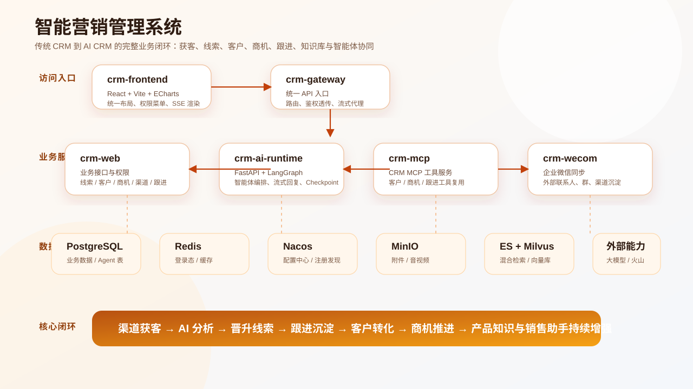
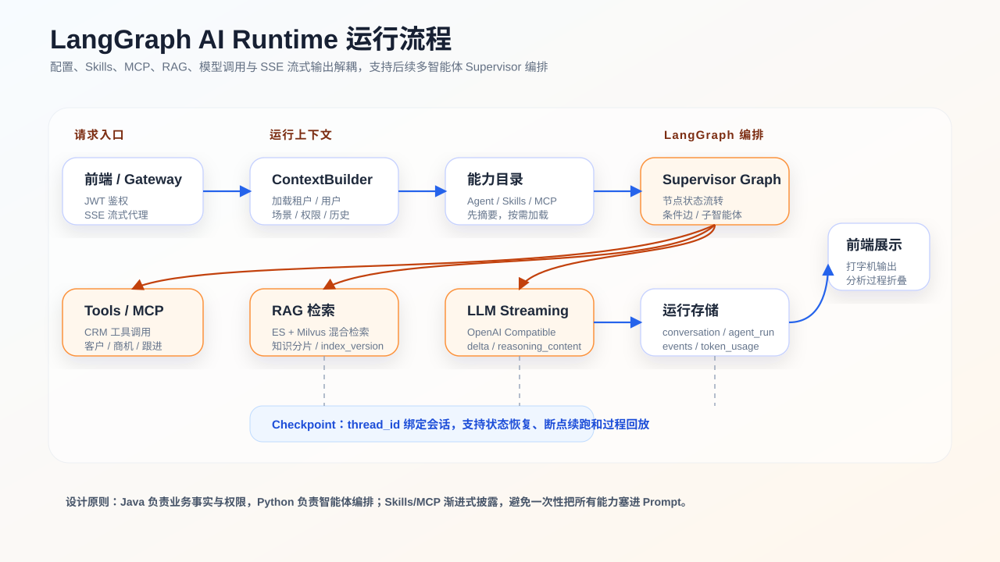

# 智能营销管理系统

智能营销管理系统是一个从传统 CRM 演进到 AI CRM 的业务系统。系统围绕渠道获客、线索转化、客户经营、商机推进、跟进沉淀和知识库增强构建，同时接入 LangGraph AI Runtime、MCP 工具服务、RAG 知识库和企业微信同步能力。

> 当前项目仍在快速迭代中。README 重点说明架构、模块边界、运行方式和部署方式，详细业务文档见 `docs/` 目录。

## 项目图示





说明：仓库中存在早期前端设计稿截图，但包含旧产品名，不放入根 README。后续建议将真实运行截图统一放到 `docs/images/screenshots/` 后再引用。

## 核心能力

- 业务工作台：核心数据统计、状态分布、销售跟进排行、今日任务提醒。
- 线索管理：线索增删改查、Excel 导入、AI 分析、线索分配、线索转客户。
- 客户管理：客户增删改查、客户详情、跟进时间轴、AI 客户深度总结。
- 商机管理：商机增删改查、客户联动、产品与报价明细、阶段推进。
- 渠道管理：渠道数据管理、企业微信同步、获客表单、文档/HTML 导入、渠道分析后晋升线索。
- 跟进记录：客户和线索跟进、富文本、图片和文件附件、音视频上传、火山语音转写。
- 销售任务：任务创建、分配、开始、完成、取消、消息提醒。
- 权限体系：菜单权限、功能权限、数据权限、角色、用户、部门、超管初始化。
- 通知与审计：站内通知、未读消息、审计日志、请求日志。
- 工具模块：客户邮件、SMTP 配置、附件发送、发送记录管理。
- 知识库：文档导入、异步切分、Embedding、ES + Milvus 混合检索、index_version 版本隔离。
- AI 智能体：智能体配置、Skills、MCP 配置、Token 用量、LangGraph 流式助手。

## 技术栈

| 层级 | 技术 |
| --- | --- |
| 前端 | React、Vite、ECharts、React Markdown、Lucide Icons |
| Java 后端 | Java 21、Spring Boot 4.1、MyBatis-Plus、JPA DDL、Redisson、Druid、Fastjson2 |
| AI Runtime | Python、FastAPI、LangGraph、LangSmith 可选、OpenAI Compatible LLM |
| 网关 | Spring Boot Gateway 服务、Nacos 服务发现、SSE 透传 |
| MCP | Spring MCP 独立服务，封装 CRM 业务工具 |
| 数据与中间件 | PostgreSQL、Redis、Nacos、MinIO、Elasticsearch、Milvus |
| 外部集成 | 企业微信、火山引擎语音转写、SMTP 邮件 |
| 部署 | Docker Compose、离线镜像包、Nacos 配置中心 |

## 目录结构

```text
.
├── backend
│   ├── crm-common          通用能力、ID、Nacos、基础配置
│   ├── crm-domain          领域模型、实体、枚举、MyBatis Mapper
│   ├── crm-application     应用服务、事务入口
│   ├── crm-auth            JWT、RBAC、登录与安全
│   ├── crm-web             主业务 Web 入口
│   ├── crm-agent-web       Java 侧 Agent 管理兼容入口
│   ├── crm-agent-runtime   Java AgentRuntime 兼容模块
│   ├── crm-knowledge       RAG 知识库接入层
│   ├── crm-mcp             独立 MCP 工具服务
│   ├── crm-gateway         统一网关
│   ├── crm-observability   审计、日志、可观测
│   └── crm-wecom           企业微信同步
├── frontend                React 前端
├── crm-ai-runtime          Python FastAPI + LangGraph AI 运行时
├── deploy                  Docker 离线部署脚本与配置模板
└── docs                    产品、架构、部署、RAG、MCP、迭代文档
```

## 架构边界

### Java 主业务服务

Java 侧负责真实业务事实、权限、审计和主数据维护：

- 用户、部门、角色、权限、租户初始化。
- 线索、客户、商机、渠道、跟进、任务、邮件、通知。
- RAG 文档管理、索引任务、知识分片元数据。
- 业务接口统一使用 POST。
- JPA 保留用于实体 DDL 初始化和表结构描述，业务读写使用 MyBatis-Plus。

### Python AI Runtime

Python 侧负责智能体运行和编排：

- FastAPI 提供 AI 接口。
- LangGraph 管理场景图、状态流、条件边、Checkpoint。
- OpenAI Compatible 接入大模型，支持 SSE 真流式输出。
- Skills 和 MCP 支持按场景挂载，后续按需做渐进式披露。
- 与 Java 使用同一个 PostgreSQL，但 AI 运行逻辑逐步迁移到 Python。

### Gateway

Gateway 是统一入口：

- 前端只访问 Gateway。
- `/api/**` 路由到 `crm-web` 或 `crm-ai-runtime`。
- AI SSE 接口保持流式透传。
- 优先通过 Nacos 发现服务，失败时可使用 fallback 地址。

## AI Runtime 设计重点

当前 AI Runtime 已具备：

- 场景图注册：`GENERAL_ASSISTANT`、`LEAD_ANALYZE`、`CUSTOMER_DEEP_SUMMARY`、`CHANNEL_ANALYZE`。
- LangGraph 节点观测：节点开始、完成、异常、耗时。
- 真流式回复：模型 `stream=true`，前端收到 `ANSWER_DELTA` 后打字机渲染。
- 推理摘要：如果模型返回 `reasoning_content`，前端折叠展示。
- Checkpoint：支持 memory 和 PostgreSQL。
- Token 统计：按用户、日期记录用量，为后续用量大盘预留。
- 智能体配置：支持从数据库加载 Agent、Skills、MCP 配置。

多智能体建议采用 `Supervisor + 子 Agent 节点/工具` 的受控模式，不建议一开始做完全自由的 Agent 网络。

## RAG 知识库

知识库当前设计目标：

- 文档导入后异步解析、清洗、切片、Embedding、入库。
- 使用 `sourceKey`、原始文件 Hash、标准化内容 Hash 避免重复训练。
- 使用 `documentVersion` 和 `index_version` 做版本隔离。
- 使用 ES + Milvus 做混合检索，支持后续召回和重排调优。
- 新版本 READY 后再切换 activeVersion，避免重建期间线上知识不可用。

详细说明见：

- `docs/knowledge-versioning-blue-green-index.md`
- `docs/sql/20260729-knowledge-versioning.sql`

## MCP 工具服务

`crm-mcp` 是独立 MCP 服务，面向其他产品线复用 CRM 业务能力。当前封装方向：

- 客户列表与详情。
- 跟进记录列表与详情。
- 商机列表与详情。
- 商机、客户、跟进聚合概览。

详细说明见：

- `docs/MCP业务工具服务说明.md`

## 本地开发

### 环境要求

- JDK 21
- Maven
- Node.js 22 或当前团队统一版本
- Python 3.11+
- Docker 可选
- PostgreSQL、Redis、Nacos、MinIO、Elasticsearch、Milvus 根据功能按需启动

### 启动前端

```bash
cd frontend
npm install
npm run dev
```

前端默认端口：`5173`。

### 启动 Java 后端

```bash
cd backend
mvn -DskipTests package
```

本地运行入口：

- `crm-web`：主业务服务
- `crm-gateway`：统一网关
- `crm-mcp`：MCP 工具服务

### 启动 Python AI Runtime

```bash
cd crm-ai-runtime
python -m venv .venv
.venv\Scripts\activate
pip install -r requirements.txt
uvicorn app.main:app --host 0.0.0.0 --port 8001 --reload
```

关键配置见：

- `crm-ai-runtime/.env.example`

## Docker 离线部署

部署文档见：

- `deploy/README.md`

典型流程：

```bash
bash deploy/scripts/build-offline-package.sh
tar -xzf crm-main-release.tar.gz -C /app/builds/products/crm/crm-app --strip-components=1
cd /app/builds/products/crm/crm-app
sh scripts/deploy-offline.sh
```

构建产物命名规范：

```text
crm-分支-release.tar.gz
```

## 配置说明

当前部署原则：

- 业务配置主要放 Nacos。
- `.env` 只保留 Docker 启动和 Nacos 引导必需项。
- 生产环境不建议将密钥写入 README 或提交到 Git。
- `deploy/nacos` 建议由线上 Nacos 配置同步生成，避免误覆盖生产配置。

详细说明见：

- `docs/deploy/NACOS_CONFIG.md`

## 开发约束

核心约束来自 `AGENTS.md`：

- Java 根包名统一为 `com.hz.crm`。
- Spring Bean 禁止构造器注入，使用 `@Autowired` 字段注入。
- Java 注释必须使用中文。
- 虽然使用 Java 21，尽量使用 JDK 8 风格语法。
- 业务读写禁止使用 `JpaRepository` 和 `EntityManager`，统一使用 MyBatis-Plus。
- JPA 只负责当前目标表结构和全新环境 DDL 初始化。
- 禁止在应用启动阶段自动修改历史数据库结构。
- 存量数据库结构不一致时，应停止自动兼容，明确提示开发人员手动处理。

## 文档索引

| 文档 | 说明 |
| --- | --- |
| `docs/product-overview-roadmap.md` | 产品说明与迭代计划 |
| `docs/project-iteration-progress.md` | 项目进度迭代表 |
| `docs/agent-runtime-design.md` | Agent Runtime 设计 |
| `docs/architecture/langgraph-gateway-design.md` | Gateway 与 LangGraph Runtime 架构 |
| `docs/agent-prompts.md` | 智能体提示词沉淀 |
| `docs/knowledge-versioning-blue-green-index.md` | 知识库版本化与蓝绿索引 |
| `docs/MCP业务工具服务说明.md` | MCP 工具服务说明 |
| `docs/wecom-active-sync.md` | 企业微信主动同步说明 |
| `deploy/README.md` | Docker 离线部署说明 |

## 当前状态

系统已经具备 CRM 主流程和 AI 能力的基础闭环，后续重点建议：

- 完善 LangGraph Supervisor 多智能体编排。
- Skills/MCP 渐进式披露和按需加载。
- RAG 召回、重排、评测集和 golden_rag 持续完善。
- AI 客户总结、渠道分析、线索分析统一迁移到 Python Runtime。
- 完善真实页面截图、演示数据和对外展示材料。
