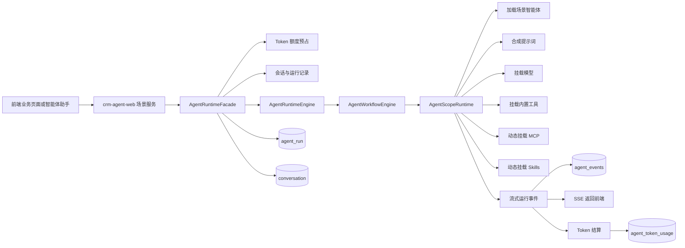
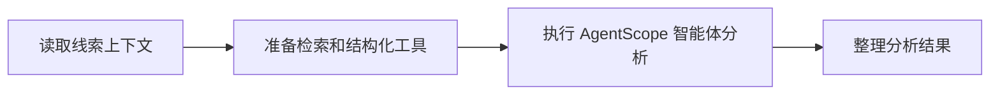
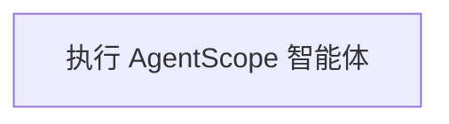
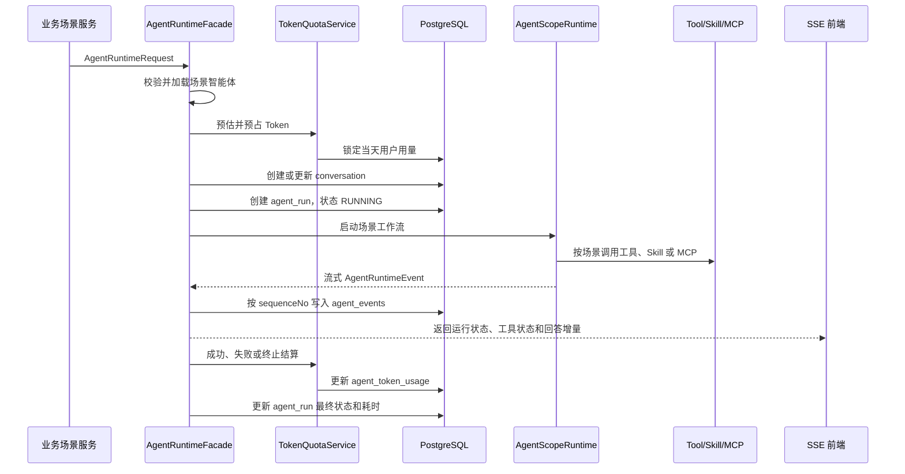

# 智能体运行时设计说明

> 文档版本：1.0  
> 更新时间：2026-07-28  
> 适用模块：`crm-agent-runtime`、`crm-agent-web`、`crm-observability`

## 1. 文档目的

本文说明智能营销管理系统当前智能体能力的真实实现，重点回答以下问题：

1. 不同业务场景的智能体如何选择、隔离和编排。
2. 系统提示词、业务提示词、Skills、MCP 和内置工具如何动态挂载。
3. 一次智能体运行如何创建会话、运行记录并持久化事件。
4. Token 额度如何分配、预占、结算和统计。
5. 如何通过运行事件、请求日志、业务审计和 Logback 日志排查问题。
6. 当前实现的边界是什么，后续如何扩展为更完整的工作流和多智能体系统。

本文描述的是当前 Java AgentRuntime 的实现。仓库中的 Python `crm-ai-runtime` 作为保留的实验工程，不属于本文所述的主运行链路。

## 2. 总体设计

智能体能力被拆分为业务入口层、运行时层、AgentScope 执行层和可观测层。



各模块职责如下：

| 模块 | 主要职责 |
| --- | --- |
| `crm-agent-web` | 接收业务请求，读取真实 CRM 数据，构造场景请求，转换 SSE 事件，处理结构化结果 |
| `crm-agent-runtime` | 场景解析、工作流执行、AgentScope 装配、Token 治理、会话与运行事件持久化 |
| `crm-knowledge` | RAG 知识库及混合检索，为智能体提供 `knowledge_search` |
| `crm-observability` | 请求日志、操作审计和管理端查询 |
| `crm-common` | 雪花 ID、Redis/Redisson、日期、异常和公共 JSON 能力 |

## 3. 核心运行对象

业务场景最终统一构造 `AgentRuntimeRequest`，然后交给 `AgentRuntimeFacade`。

主要字段如下：

| 字段 | 用途 |
| --- | --- |
| `tenantId` | 租户隔离，所有智能体、会话、运行和用量数据均依赖该字段 |
| `userId` | 当前使用人，也是 Token 额度和会话权限的归属人 |
| `agent` | 业务入口初步指定的智能体，运行时仍会按场景重新校验 |
| `sceneCode` | 场景路由键，例如 `LEAD_ANALYZE`、`CHANNEL_ANALYZE` |
| `message` | 发送给模型的本次业务消息 |
| `injectedPrompt` | 由业务场景强制注入的运行约束 |
| `sessionId` | 会话自然键；没有传入时由场景、智能体和用户生成 |
| `conversationId` | 已有会话编号，用于继续会话 |
| `businessType` | 业务对象类型，例如 `LEAD`、`CHANNEL`、`CUSTOMER` |
| `businessId` | 业务对象编号 |
| `context` | 场景上下文、标题、附件和运行时变量 |
| `mcps` | 场景智能体启用的 MCP 配置，运行准备阶段加载 |
| `skills` | 场景智能体启用的 Skill 配置，运行准备阶段加载 |
| `runId` | 本次运行编号，由 `AgentRuntimeFacade` 创建 |

`tenantId`、`userId`、`sceneCode` 和 `message` 是一条运行链路能够成立的基础条件。

## 4. 智能体编排

### 4.1 场景路由与隔离

智能体不是由调用方随意指定后直接启动，而是先根据 `sceneCode` 查找当前租户下启用的场景智能体。

核心逻辑位于：

- `AgentRuntimeSceneService`
- `AgentDefinitionService`

运行准备阶段执行以下检查：

1. 请求必须包含租户。
2. 优先使用请求中的 `sceneCode`，没有时使用请求智能体的场景编码。
3. 从 `agents` 表查询该租户、该场景下启用的智能体。
4. 同一租户、同一场景只能启用一个智能体。
5. 如果业务入口传入了智能体编号，该编号必须与场景智能体一致。
6. 加载该智能体启用的 MCP 和 Skills。
7. 把场景编码、场景名称、智能体编号和智能体名称写入运行上下文。

这套校验解决了两个问题：

- 不同场景的系统提示词、工具和 Skills 不会串用。
- 调用方不能绕过场景配置，临时启动另一个不匹配的智能体。

当前系统使用的主要场景包括：

| 场景编码 | 用途 |
| --- | --- |
| `LEAD_ANALYZE` | 线索分析、评分、转化建议和客户档案补充 |
| `CHANNEL_ANALYZE` | 渠道材料整理、购买意向和风险分析 |
| `CUSTOMER_DEEP_SUMMARY` | 客户资料、跟进记录和商机的深度总结 |
| `GENERAL_ASSISTANT` | 通用智能体助手和营销问答 |

### 4.2 提示词分层

最终系统提示词由 `AgentRuntimePromptService` 按固定顺序合成：

```text
平台基础提示词
    ↓
场景智能体系统提示词
    ↓
本次业务调用注入提示词
    ↓
使用 context 替换 ${变量}
```

各层职责如下：

| 层级 | 来源 | 作用 |
| --- | --- | --- |
| 平台基础提示词 | `crm.agent.prompt.base` | 全系统共同遵守的真实性、安全性和身份约束 |
| 场景系统提示词 | `agents.system_prompt` | 可在智能体配置中动态调整的角色、任务和行为规则 |
| 注入提示词 | 业务场景服务 | 本次调用不可被场景配置覆盖的边界，例如只分析当前线索、必须调用结果函数 |
| 上下文变量 | `AgentRuntimeRequest.context` | 注入租户、场景、业务对象及会话相关变量 |

场景智能体只会加载自己的系统提示词。其他场景不会加载当前场景的提示词、Skills 或 MCP。

### 4.3 Java 工作流编排

工作流入口为 `AgentWorkflowEngine`，流程定义由 `AgentWorkflowCatalog` 根据场景选择。

当前节点类型包括：

| 节点类型 | 处理器 | 作用 |
| --- | --- | --- |
| `EVENT` | `AgentWorkflowEventNodeHandler` | 生成可展示、可持久化的流程步骤事件 |
| `AGENT_SCOPE` | `AgentWorkflowAgentScopeNodeHandler` | 启动一次 AgentScope 智能体执行 |

节点通过 Reactor `concatWith` 顺序串联，因此当前工作流是确定性的串行流程。

线索分析当前定义为：



其他未单独定义工作流的场景使用默认流程：



这里需要区分两种“编排”：

1. Java 工作流负责任务节点的确定性顺序、状态事件和未来的分支扩展。
2. AgentScope 内部负责模型思考、选择工具、读取 Skill、调用 MCP 和继续迭代的 ReAct 循环。

因此当前架构是“外层确定性工作流 + 内层 Agent 自主工具调用”，不是完全由大模型决定所有业务流程。

### 4.4 AgentScope 运行时装配

`AgentScopeRuntime.buildRuntime` 每次运行都会重新组装当前场景所需能力：

1. 再次加载并校验场景智能体。
2. 创建本次运行独立的 `Toolkit`。
3. 按场景注册 Java 内置工具。
4. 动态连接启用的 MCP 服务。
5. 创建当前智能体的独立工作目录。
6. 把启用的 Skill 物化为工作目录中的 `SKILL.md`。
7. 合成系统提示词。
8. 根据智能体配置创建 OpenAI 兼容模型。
9. 构造 AgentScope `HarnessAgent`。
10. 使用流式事件方式执行。

模型配置支持 OpenAI 兼容协议。`DEEPSEEK` 和 `DASHSCOPE` 在未填写地址时会使用系统内置的兼容地址，其他供应商可以通过 `baseUrl` 接入。

模型循环次数来自智能体的 `maxIters`：

- 默认值为 `8`。
- 最小值为 `1`。
- 最大值为 `50`。

`maxIters` 限制的是单次智能体运行最多进行多少轮模型与工具交互，避免错误提示词或工具循环无限消耗资源。

### 4.5 内置工具按场景挂载

Java 工具通过 `AgentRuntimeToolProvider` 扩展点注册。每个 Provider 根据 `sceneCode` 判断是否返回工具。

例如：

- `LEAD_ANALYZE` 可以挂载企业公开信息检索、知识库检索和线索结构化结果工具。
- `CHANNEL_ANALYZE` 可以挂载企业公开信息检索、知识库检索和渠道结构化结果工具。
- `GENERAL_ASSISTANT` 挂载营销助手允许使用的业务工具。

同名工具在一次运行中只注册一次，避免多个 Provider 重复挂载。

业务 Tool Provider 是场景隔离的重要边界。即使其他场景的工具 Bean 已经存在于 Spring 容器，只要 Provider 没有为当前 `sceneCode` 返回该工具，本次智能体就无法调用它。

### 4.6 Skills 动态挂载

Skills 存储在 `agent_skill` 表，并与智能体绑定。

运行时只加载：

- 当前租户的数据。
- 当前场景智能体的数据。
- `enabled = true`。
- `deleted = false`。

`AgentRuntimeSkillMountService` 会把每个 Skill 写入当前智能体工作目录：

```text
{agentWorkspace}/skills/{skillKey}/SKILL.md
```

随后将 `skills` 根目录交给 AgentScope。这样可以在管理后台修改 Skill 内容，而不需要重新编译 Java 工程。

Skill 名称会转换为安全目录名，避免使用非法路径字符。

### 4.7 MCP 动态挂载

MCP 配置存储在 `agent_mcp` 表，并与智能体绑定。

当前支持：

| 传输类型 | 配置内容 |
| --- | --- |
| `SSE` | 服务地址和请求头 |
| `STREAMABLE_HTTP` | 服务地址和请求头 |
| `STDIO` | 命令、参数和环境变量 |

`AgentRuntimeMcpMountService` 在本次运行创建 Toolkit 时连接 MCP，并把 MCP 提供的工具注册到当前智能体。

MCP 默认超时时间为 60 秒，可通过 `crm.agent.mcp.timeout-seconds` 调整。

MCP 只对绑定它的智能体生效，不会全局挂载。

### 4.8 结构化结果函数

线索分析和渠道分析不仅依靠自然语言提示词，还提供专用结果工具：

- `lead_analysis_result`
- `channel_analysis_result`

工具通过 JSON Schema 限制字段、类型、枚举和数组长度。场景注入提示词要求模型最终调用结果工具，而不是自由输出一段不稳定的 Markdown。

对于渠道分析，结果工具在真正执行时会把函数参数直接绑定到本次 `AgentRuntimeRequest`。业务服务优先读取真实函数参数，不再从多个工具的流式文本中重新拼接 JSON。

这种方式把职责分成两部分：

- 大模型负责理解材料并决定字段值。
- Java 负责定义输出协议、校验、持久化和业务回填。

自然语言提示词是行为约束，Function Call 参数才是结构化结果的权威来源。

## 5. 一次运行的完整生命周期

一次智能体调用经过以下过程：



### 5.1 会话

`conversation` 表代表用户与某个智能体的一段会话。

会话匹配条件包括：

- `tenant_id`
- `user_id`
- `agent_id`
- `session_id`

如果调用方提供 `conversationId`，系统还会校验该会话是否属于当前租户、用户和智能体。

会话记录保存场景、业务对象、标题、上下文和最后消息时间，但不会把“正在运行”当成历史会话的长期状态展示。

### 5.2 运行

`agent_run` 表代表一次完整调用。

关键字段包括：

| 字段 | 说明 |
| --- | --- |
| `status` | `RUNNING`、`SUCCESS`、`FAILED` 或 `STOPPED` |
| `input_text` | 本次发送给智能体的消息 |
| `input_json` | 本次运行上下文 |
| `output_text` | 面向用户的最终回答，不包含工具结果事件 |
| `error_message` | 失败原因 |
| `started_at`、`finished_at` | 开始和结束时间 |
| `elapsed_ms` | 总耗时 |
| `input_token_count` | 输入 Token |
| `output_token_count` | 输出 Token |
| `total_token_count` | 总 Token |
| `estimated_token_count` | 其中通过本地算法估算的 Token |
| `usage_estimated` | 是否为估算用量 |
| `reserved_token_count` | 运行开始时预占的 Token |
| `daily_token_limit` | 运行发生时用户的每日额度快照 |

`agent_run` 是回答、错误、耗时和成本统计的主记录。

### 5.3 事件

`agent_events` 表保存运行中的每个事件，并使用 `sequence_no` 保证同一次运行内的顺序。

当前会保存：

- 工作流步骤。
- 文本增量。
- Agent 最终结果。
- 工具调用开始。
- 工具结果增量和结束。
- AgentScope 返回的事件元数据。
- 能够从事件中读取到的 Token usage。

每条事件都会补充：

- `runId`
- `conversationId`

因此前端收到事件后，可以立即知道它属于哪次运行和哪段会话。

### 5.4 输出聚合

`AgentRuntimeFacade` 聚合最终回答时会排除：

- 工具调用事件。
- 工具结果事件。
- 工作流步骤事件。

只把模型回答的文本增量作为 `agent_run.output_text`。

这可以避免把知识库原始检索结果、工具协议 JSON 或内部流程文字直接展示给销售人员。

## 6. Token 额度与用量统计

### 6.1 数据模型

Token 相关数据分为两类：

| 表 | 作用 |
| --- | --- |
| `agent_token_quota_user` | 保存每个用户最终生效的每日额度 |
| `agent_token_usage` | 按租户、用户、日期累计实际用量和请求次数 |

`agent_token_usage` 使用以下组合保证每日唯一：

```text
tenant_id + user_id + usage_date
```

这套设计便于后续直接按租户、部门、用户和日期聚合用量大盘。

### 6.2 用户、部门和全公司的额度分配

系统的最终额度始终落到用户。

- 给单个用户设置：更新该用户额度。
- 给部门设置：找出当前部门内所有用户，逐个写入用户额度。
- 给全公司设置：找出当前租户所有用户，逐个写入用户额度。

`assign_scope`、`assign_target_id` 和 `assign_target_name` 用来记录这次用户额度来自个人、部门还是全公司分配。

运行时不再递归计算组织树，也不需要同时读取公司额度、部门额度和个人额度。它只查当前用户最终生效的额度，从而减少高频调用链路的复杂度。

如果用户没有单独额度，则使用系统默认值：

```yaml
crm:
  agent:
    token:
      daily-limit: 100000
      reserve-output-tokens: 2048
```

对应环境变量：

```text
CRM_AGENT_TOKEN_DAILY_LIMIT
CRM_AGENT_TOKEN_RESERVE_OUTPUT_TOKENS
```

### 6.3 调用前预占

系统不会等模型调用结束后才判断额度，而是在创建会话和运行记录之前先预占。

预占量计算如下：

```text
预占 Token = 预计输入 Token + 预留输出 Token
```

预计输入包括：

- 平台基础提示词。
- 场景系统提示词。
- 本次注入提示词。
- 本次业务消息。

当前本地估算规则为：

- 非 ASCII 字符按 1 Token 估算。
- ASCII 非空白字符按每 4 个字符约 1 Token 估算。
- 空白字符不计入估算。

该算法用于调用前额度保护，不用于替代模型供应商返回的真实 usage。

系统检查：

```text
当天已用 Token + 其他运行已预占 Token + 本次预占 Token <= 每日额度
```

额度不足时，模型不会被调用。

### 6.4 并发安全

同一用户可能同时从多个页面或多个应用节点发起 AI 请求，因此预占和结算使用双层并发保护：

1. Redisson 分布式锁。
2. PostgreSQL `FOR UPDATE` 行锁。

分布式锁键：

```text
crm:agent:token-usage:{tenantId}:{userId}:{usageDate}
```

当前 Redisson 锁参数：

- 最长等待 3 秒。
- 自动租约 10 秒。

即使系统部署多个实例，同一用户同一天的预占和结算也会串行处理，避免额度被并发穿透。

### 6.5 运行中采集

`AgentRuntimeEventMapper` 会尝试从 AgentScope 事件读取：

- `inputTokens`
- `outputTokens`
- `totalTokens`

为了避免流式过程中相同累计 usage 被重复计算，当前 `TokenUsageCounter` 对同一字段保留事件中出现的最大值。

### 6.6 成功结算

成功结束时分两种情况：

1. 模型事件提供了有效 usage：优先使用模型返回值，`usage_estimated = false`。
2. 模型没有返回 usage：使用本地算法估算输入和最终回答，`usage_estimated = true`。

结算过程：

1. 释放本次 `reserved_token_count`。
2. 累加输入、输出和总 Token。
3. 如果是估算值，累加 `estimated_token_count`。
4. `success_count + 1`。
5. 把本次用量快照回写到 `agent_run`。

### 6.7 失败和终止

失败时：

- 释放本次预占。
- `failed_count + 1`。
- 当前实现不把失败调用的输入估算计入当天已用 Token。

用户主动终止时：

- 取消 Reactor Subscription。
- `AgentRuntimeFacade.doOnCancel` 把运行状态更新为 `STOPPED`。
- 释放本次预占。
- 按当前产品约定，不继续统计本次终止运行的 Token。

请求次数在预占时已经增加，因此成功、失败或终止的运行都会进入请求总数。

### 6.8 今日用量

今日用量接口返回：

- 每日额度。
- 输入、输出和总 Token。
- 估算 Token。
- 正在运行任务的预占 Token。
- 请求数、成功数和失败数。
- 剩余额度。
- 额度来源。

剩余额度计算为：

```text
每日额度 - 已用 Token - 正在运行任务的预占 Token
```

## 7. 可观测设计

当前系统没有把可观测性完全交给外部平台，而是在业务数据库中保留可回放的智能体运行链路，再结合 HTTP Trace、审计日志和文件日志进行排查。

### 7.1 运行链路标识

智能体链路的主要标识为：

| 标识 | 用途 |
| --- | --- |
| `conversationId` | 定位一段用户会话 |
| `runId` | 定位一次智能体运行 |
| `eventId` | 定位单个 AgentScope 或前端事件 |
| `sequenceNo` | 还原同一次运行的事件顺序 |
| `businessType + businessId` | 从智能体运行反查 CRM 业务对象 |
| `traceId` | 定位一次 HTTP 请求和对应应用日志 |

其中 `runId` 是智能体内部排查的主键，`traceId` 是 Web 请求排查的主键。

### 7.2 智能体运行追踪

排查一次智能体运行时，可以按以下顺序查看：

```sql
select *
from agent_run
where id = :runId;

select *
from agent_events
where run_id = :runId
order by sequence_no asc;

select *
from conversation
where id = :conversationId;
```

从 `agent_run` 可以判断：

- 是否成功。
- 是否被终止。
- 总耗时。
- 最终回答。
- 错误信息。
- Token 是否为估算值。

从 `agent_events` 可以判断：

- 工作流走到了哪个节点。
- 模型是否开始输出。
- 调用了哪些工具。
- 工具是否返回。
- Function Call 是否发生。
- 最终回答是否完整。
- 模型是否返回 Token usage。

### 7.3 SSE 实时可观测

AgentScope 的底层事件不会全部原样展示给最终用户。`AgentAssistantWorkbenchService` 会把事件转换成稳定的前端协议：

| 前端事件 | 含义 |
| --- | --- |
| `RUN_STATUS_CHANGED` | 智能体开始处理 |
| `TOOL_CALL_STARTED` | 开始调用辅助能力 |
| `TOOL_RESULT_FINISHED` | 辅助能力完成 |
| `ANSWER_DELTA` | 回答文本增量 |
| `ANSWER_FINISHED` | 回答文本结束 |
| `RUN_FINISHED` | 本次运行全部完成 |
| `RUN_ERROR` | 本次运行异常 |

工具原始结果不会直接发送给前端，前端只展示适合用户理解的阶段信息和最终回答。

### 7.4 HTTP 请求日志

`RequestLogFilter` 为每个请求生成或继承 `X-Trace-Id`：

1. 优先读取请求头中的 `X-Trace-Id`。
2. 没有时生成 UUID。
3. 写入 MDC。
4. 通过响应头 `X-Trace-Id` 返回。
5. 请求结束后写入 `obs_request_log`。

请求日志记录：

- 租户、用户和用户名。
- 请求方法和地址。
- 客户端 IP 和 User-Agent。
- HTTP 状态码。
- 请求耗时。
- 是否成功。
- 系统错误码和错误信息。

### 7.5 Logback 文件日志

Logback 日志格式包含 MDC 中的 `traceId`：

```text
时间 级别 [线程] [traceId] 日志类 - 消息
```

日志分为：

- 控制台日志。
- 普通滚动文件。
- ERROR 独立滚动文件。

开发环境同时输出控制台和文件，生产环境默认只输出文件。文件按日期和大小滚动，默认保存 30 天，单文件默认最大 100 MB。

### 7.6 操作审计

管理和业务写操作通过 `@AuditOperation` 和 `AuditOperationAspect` 写入 `obs_audit_log`。

审计内容包括：

- 操作模块和动作。
- 操作人。
- 目标类型、目标编号和目标名称。
- 成功或失败。
- 执行耗时。
- 方法签名。
- `traceId`。
- 脱敏后的请求参数。
- 异常类型和异常信息。

密码、密钥、Token、Authorization 和 Credential 等敏感字段会替换为 `******`。

请求日志回答“哪个接口什么时候出错”，审计日志回答“谁对哪个业务对象做了什么”，智能体事件回答“模型和工具内部执行到了哪里”。三者关注点不同。

## 8. 常见问题排查

### 8.1 智能体没有启动

依次检查：

1. `sceneCode` 是否正确。
2. 当前租户下是否存在启用的场景智能体。
3. 同一场景是否错误地启用了多个智能体。
4. 智能体是否配置模型名称、地址和密钥。
5. 今日 Token 额度是否充足。
6. `agent_run` 是否已经创建，状态和 `error_message` 是什么。

### 8.2 智能体没有调用预期工具

依次检查：

1. 当前场景的 `AgentRuntimeToolProvider` 是否返回该工具。
2. 工具名是否重复，是否被去重。
3. 场景系统提示词是否明确说明何时调用。
4. 本次注入提示词是否与系统提示词冲突。
5. `agent_events` 中是否存在 `TOOL_CALL_START`。
6. `maxIters` 是否过小，导致检索之后没有剩余轮次提交结果。

### 8.3 结构化结果解析失败

依次检查：

1. 是否存在对应结果函数的工具调用事件。
2. 模型传入的字段是否符合工具 JSON Schema。
3. 是否把 JSON 当成字符串传入，而不是直接传对象。
4. 是否在函数调用之后继续输出了自然语言。
5. 结果工具是否绑定到了本次 `AgentRuntimeRequest`。

渠道分析目前直接读取结果函数的真实参数，不依赖工具事件文本拼接。

### 8.4 Token 数字与供应商后台不完全一致

检查 `agent_run.usage_estimated`：

- `false`：系统使用了模型事件返回的 usage。
- `true`：模型未提供有效 usage，系统使用本地算法估算。

还需要确认模型供应商返回的 usage 是整次运行累计值，还是单轮模型调用值。

### 8.5 前端已经停止，后台运行仍未结束

检查：

1. 前端是否调用了终止接口。
2. `requestId` 是否与启动运行时一致。
3. 当前实例的 `activeRuns` 中是否仍有该请求。
4. Reactor Subscription 是否已经取消。
5. `agent_run` 是否最终变成 `STOPPED`。

## 9. 当前实现边界

以下内容需要明确区分，避免把规划能力当成已经完成的能力：

1. 当前工作流是代码内定义的串行节点，还不支持后台可视化编辑流程。
2. 当前核心模型是“一场景一个启用智能体”，尚未实现多个智能体之间的路由、委派和结果汇总。
3. 当前没有条件分支、并行节点、人工审批节点、自动重试节点和持久化 Checkpoint。
4. `agent_events` 当前逐条同步写入数据库，高并发下需要评估批量写入或消息队列。
5. Token 事件采集使用最大值避免流式重复；如果供应商对多轮模型调用返回的是单轮值而不是累计值，需要增加模型调用级别的用量明细后再求和。
6. HTTP `traceId` 当前主要存在于请求日志、审计日志和 Logback 中，`agent_run` 尚未直接保存 `traceId`。
7. 智能体助手使用异步线程执行，当前安全上下文会手动传递，但 MDC `traceId` 尚未形成统一的异步传播机制。
8. 用户主动终止后按当前产品约定不统计实际已消耗 Token，因此系统用量可能低于模型供应商账单。
9. 工具结果可能包含客户或知识库原始内容，`agent_events` 需要进一步补充字段级脱敏和数据保留策略。
10. 智能体定义、MCP 和 Skill 的部分配置管理仍使用 Spring Data Repository；按照当前工程约束，业务查询和写入需要继续迁移到 MyBatis-Plus，JPA 只保留实体 DDL。

## 10. 后续演进建议

### 10.1 第一阶段：补齐追踪和计量

建议优先完成：

1. 在 `AgentRuntimeRequest`、`agent_run` 和 `agent_events` 中贯通 `traceId`。
2. 为异步线程和 Reactor Context 统一传播 MDC。
3. 增加模型调用级用量表，记录供应商请求编号、模型、输入、输出、总 Token、耗时和是否估算。
4. 增加 Tool Call 编号，把工具开始、参数、结果和结束稳定关联。
5. 对工具参数和结果增加统一脱敏器。

### 10.2 第二阶段：工作流持久化

把 `AgentWorkflowCatalog` 从纯代码目录升级为“代码默认模板 + 数据库场景定义”：

```text
workflow_definition
workflow_node
workflow_edge
workflow_checkpoint
```

建议增加的节点类型：

- `AGENT`
- `TOOL`
- `ROUTER`
- `PARALLEL`
- `JOIN`
- `APPROVAL`
- `TRANSFORM`
- `END`

业务关键流程仍由 Java 节点保证确定性，大模型只负责节点内部的理解、分析和工具选择。

### 10.3 第三阶段：多智能体

在现有“一场景一主智能体”基础上增加：

- 主智能体负责理解目标和路由。
- 检索智能体负责知识库和公开信息。
- 分析智能体负责业务判断。
- 合规智能体负责真实性和敏感信息检查。
- 汇总节点负责结构化结果合并。

多智能体之间不直接共享全部上下文，而是通过经过定义和校验的状态对象传递数据，避免提示词、客户数据和工具权限串场。

### 10.4 第四阶段：监控大盘

建议基于现有数据增加：

- 按租户、部门、用户、智能体、场景和模型统计 Token。
- 成功率、失败率和终止率。
- 平均耗时、P95 和 P99。
- 工具调用次数、失败率和耗时。
- 知识库命中率。
- Function Call 合规率。
- 单次运行成本和每日成本趋势。

可以先直接聚合 PostgreSQL 数据，数据量增加后再接入 Prometheus、OpenTelemetry 和专用 Trace 平台。

## 11. 关键代码索引

| 能力 | 关键类 |
| --- | --- |
| 统一运行入口 | `AgentRuntimeFacade` |
| AgentScope 装配 | `AgentScopeRuntime` |
| 场景加载与隔离 | `AgentRuntimeSceneService` |
| 提示词合成 | `AgentRuntimePromptService` |
| 模型创建 | `AgentRuntimeModelFactory` |
| 工作流执行 | `AgentWorkflowEngine` |
| 工作流目录 | `AgentWorkflowCatalog` |
| MCP 挂载 | `AgentRuntimeMcpMountService` |
| Skill 挂载 | `AgentRuntimeSkillMountService` |
| Java 工具扩展点 | `AgentRuntimeToolProvider` |
| AgentScope 事件转换 | `AgentRuntimeEventMapper` |
| Token 额度与结算 | `AgentTokenQuotaService` |
| Token 批量分配 | `AgentTokenQuotaManageService` |
| 智能体助手 SSE | `AgentAssistantWorkbenchService` |
| HTTP 请求追踪 | `RequestLogFilter` |
| 操作审计 | `AuditOperationAspect` |
| 文件日志配置 | `logback-spring.xml` |

## 12. 总结

当前智能体运行时的核心思路是：

```text
场景决定智能体
    + 场景决定工具权限
    + 配置决定提示词、Skills、MCP 和模型
    + Java 工作流保证确定性顺序
    + AgentScope 负责单节点内的自主推理和工具调用
    + Function Call 保证关键业务结果结构化
    + Token 预占和结算控制成本
    + conversation、agent_run、agent_events 保留完整运行链路
```

这套架构已经具备继续扩展工作流和多智能体的基础，但当前应将其准确理解为“可配置的场景智能体运行时”，而不是已经完成的通用图编排平台。
